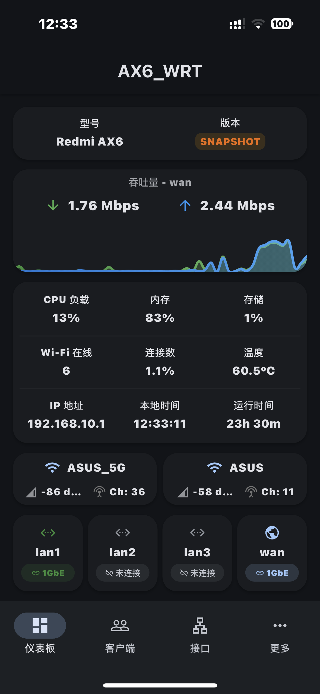
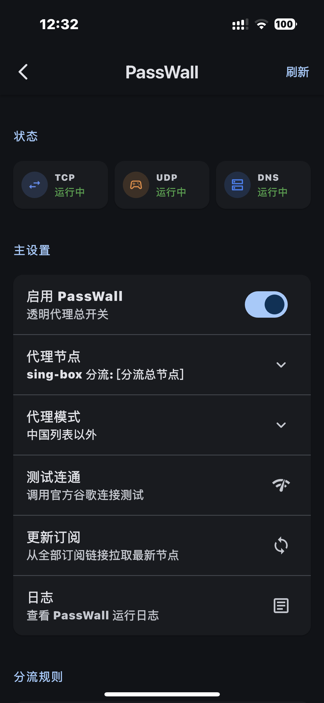
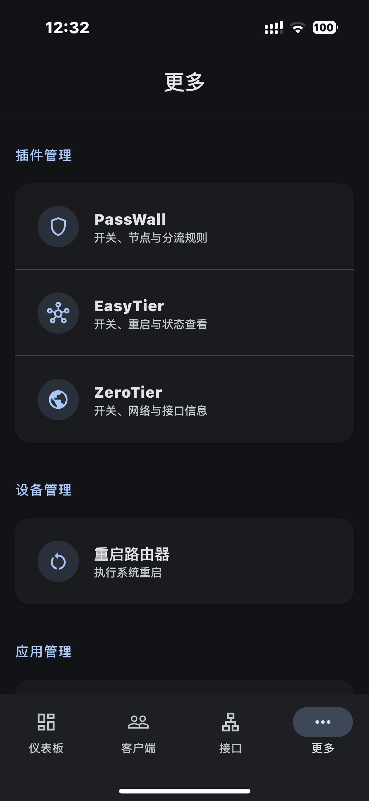

# LuCI Mobile

<div align="center">

[](https://github.com/fightroad/luci-mobile/releases)
[](https://github.com/fightroad/luci-mobile/releases)

面向 OpenWrt / LuCI 的移动端管理应用：重监控、轻设置，支持多路由器与常用插件。

[下载 Releases](https://github.com/fightroad/luci-mobile/releases) · [Issues](https://github.com/fightroad/luci-mobile/issues)

</div>

## 预览

<table>
  <tr>
    <td align="center" width="33%"><b>仪表板</b></td>
    <td align="center" width="33%"><b>PassWall</b></td>
    <td align="center" width="33%"><b>更多</b></td>
  </tr>
  <tr>
    <td align="center" valign="top">
      
    </td>
    <td align="center" valign="top">
      
    </td>
    <td align="center" valign="top">
      
    </td>
  </tr>
</table>

## 功能

- **仪表板监控**：系统负载、内存、接口吞吐、无线与网口状态；支持 Wi‑Fi 二维码分享、网口流量详情
- **多路由器**：添加 / 切换 / 编辑多台路由，凭证本机安全存储，数据相互隔离
- **客户端与接口**：在线设备、有线 / 无线归属、接口地址与流量
- **插件（检测到才显示）**
  - **PassWall**：开关、节点与分流、连通性测试、TCP / UDP / DNS 运行状态、日志
  - **EasyTier**：核心开关、重启、状态与节点
  - **ZeroTier**：服务与网络开关、应用配置、`zt*` 接口信息
- **系统**：远程重启、主题与显示偏好

## 安装

从 [GitHub Releases](https://github.com/fightroad/luci-mobile/releases) 下载安装包。

或自行构建：

```bash
git clone https://github.com/fightroad/luci-mobile.git
cd luci-mobile
flutter pub get
flutter run
```

- Flutter 3.32+ / Dart 3.8+
- Android：`flutter build apk --release`
- iOS：`flutter build ios --release`

## 路由器要求

- 已启用 LuCI，并安装 RPC 相关组件，例如：

```bash
opkg update
opkg install luci-mod-rpc rpcd-mod-luci rpcd-mod-iwinfo luci-mod-status
/etc/init.d/rpcd restart
```

- 确认：`ubus list luci-rpc`
- 插件功能需路由器上已安装对应 luci-app（如 `luci-app-passwall`、`luci-app-easytier`、`luci-app-zerotier`）

## 故障排查

| 问题 | 建议 |
|------|------|
| 连接失败 | 检查 IP、防火墙，尝试 HTTP / HTTPS |
| 认证失败 | 确认账号密码与管理员权限 |
| 无数据 | 确认 `luci-rpc` 可用，必要时重启 `rpcd` 或整机 |

## 许可与致谢

- 许可：[GPL-3.0](LICENSE)
- 上游项目：[cogwheel0/luci-mobile](https://github.com/cogwheel0/luci-mobile)
- 社区：OpenWrt / LuCI、Flutter
- 灵感：[OpenWrtManager](https://github.com/hagaygo/OpenWrtManager)
